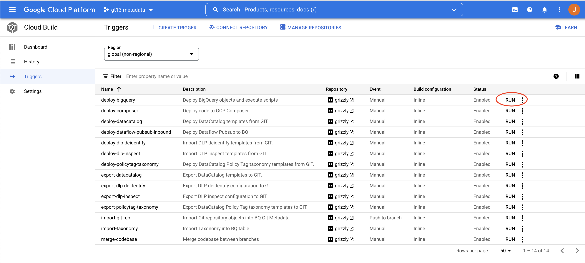
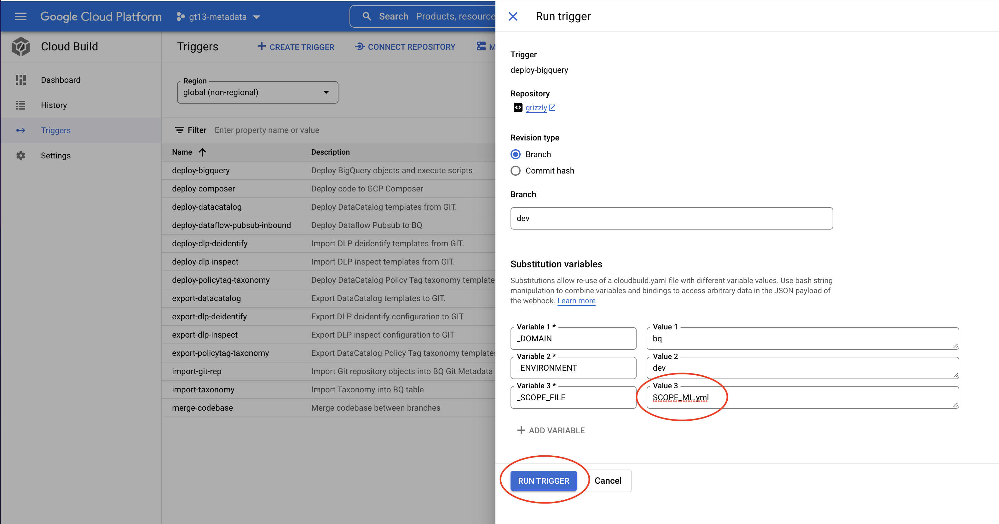
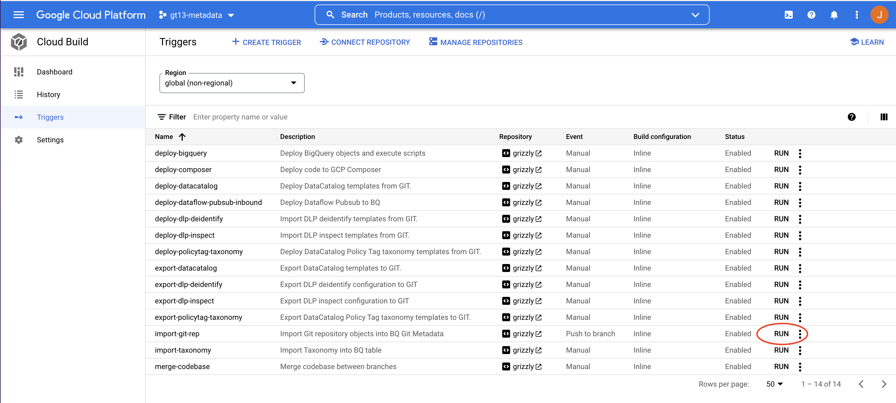
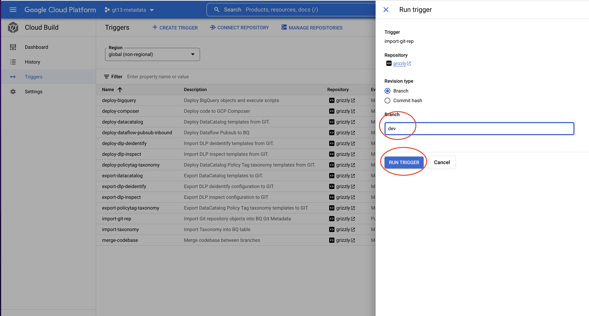
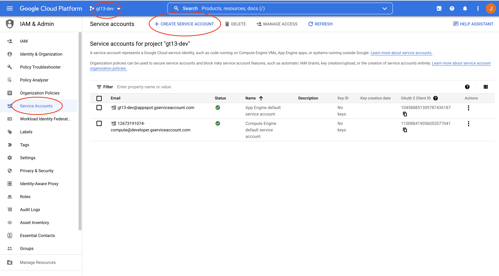
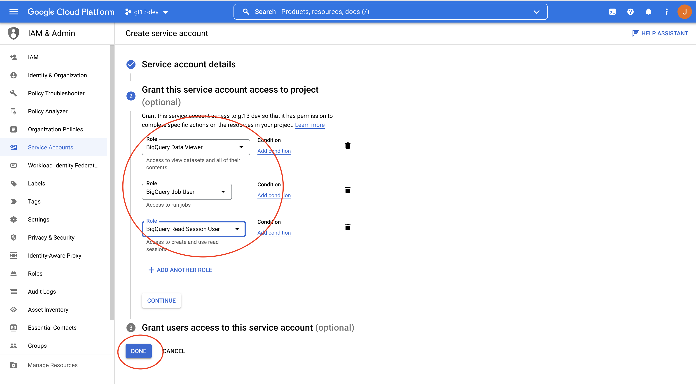
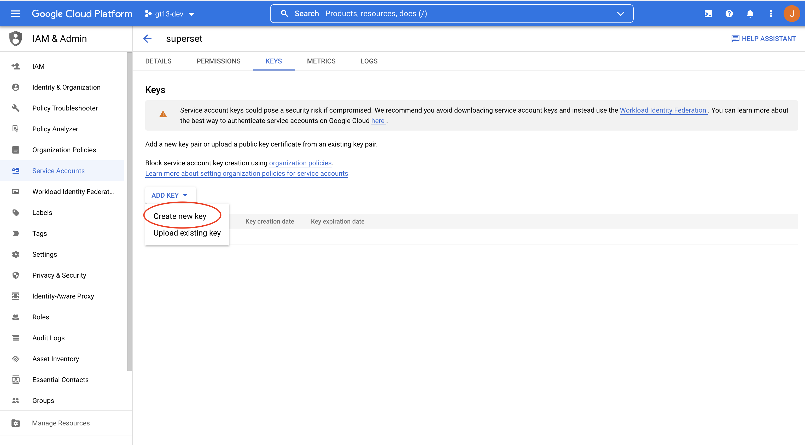
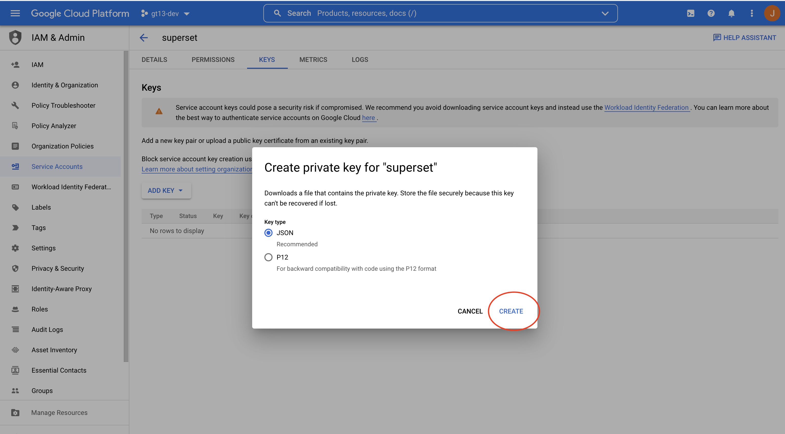

# How to install Grizzly

## Creating Google Cloud Projects

For this platform, you need four Google Cloud
[projects](https://cloud.google.com/resource-manager/docs/cloud-platform-resource-hierarchy#projects)
with the Project IDs as [stem_name]-metadata, [stem_name]-dev, [stem_name]-uat,
and [stem_name]-prod. For example, grizzly-metadata, grizzly-dev, grizzly-uat,
and grizzly-prod. Please note that while it is possible to set a Project's name
and ID as different values, it is important that the name and ID should match
exactly.

Create new projects for this tutorial.

1.  [Create a Google Cloud project](https://console.cloud.google.com/projectselector2/home/dashboard).
1.  Make sure that
    [billing is enabled](https://support.google.com/cloud/answer/6293499#enable-billing)
    for your Google Cloud project.

## Costs

This tutorial uses billable components of Google Cloud, including the following:

*   [BigQuery](https://cloud.google.com/bigquery/pricing)
*   [Cloud Build](https://cloud.google.com/build/pricing)
*   [Cloud Composer](https://cloud.google.com/composer/pricing)
*   [Cloud Data Loss Prevention](https://cloud.google.com/dlp/pricing)
*   [Cloud Pub/Sub](https://cloud.google.com/pubsub/pricing)
*   [Cloud Source Repositories](https://cloud.google.com/source-repositories/pricing)
*   [Cloud Storage](https://cloud.google.com/storage/pricing)
*   [Data Catalog](https://cloud.google.com/data-catalog/pricing)
*   [Dataflow](https://cloud.google.com/dataflow/pricing)

Use the [pricing calculator](https://cloud.google.com/products/calculator) to
generate a cost estimate based on your projected usage.

## Enabling Cloud Shell

[Open Cloud Shell](https://console.cloud.google.com/?cloudshell=true).

At the bottom of the Cloud Console, a
[Cloud Shell](https://cloud.google.com/shell/docs/features) session opens and
displays a command-line prompt. Cloud Shell is a shell environment with the
Cloud SDK already installed, including the
[gcloud](https://cloud.google.com/sdk/gcloud/) command-line tool, and with
values already set for your current project. It can take a few seconds for the
session to initialize.

## Setting up your environment

1.  In Cloud Shell, set your Git credentials, clone the source repository, and
    go to the directory for this tutorial.

    ```
    git config --global user.email "email@mail.xyz"
    ```

    ```
    git config --global user.name "Your Name"
    ```

    ```
    sudo rm -rf ~/grizzly_repo && mkdir ~/grizzly_repo
    ```

    ```
    cd ~/grizzly_repo
    ```

    ```
    gh auth login
    ```

    ```
    gh repo clone google/grizzly
    ```

2.  In Cloud Shell, set the required environment variables.

    *   The [stem_name] value should match the Project IDs you created earlier.
    *   The [composer instance location] value should be from a Region Name from
        the list of available
        [Cloud Storage locations](https://cloud.google.com/storage/docs/locations#available-locations).
        Please note that the Grizzly platform does not currently support
        Dual-regions or Multi-regions.
    *   The [composer image] value should be a Version from the list of
        [Cloud Composer images](https://cloud.google.com/composer/docs/concepts/versioning/composer-versions#images).
    *   The [default security user] value is an optional parameter that can be
        used to define a default user or group that will be configured for
        Grizzly's two demo examples. If not defined, the current Git session
        user will be used. Supported formats of the parameter are
        user:joe@example.com or group:demo@google.com.

        ```
        cd ~/grizzly_repo/grizzly
        ./tools/init_grizzly_environment_from_scratch.sh \
        --GCP_PROJECT_METADATA "[stem_name]-metadata" \
        --GCP_PROJECT_DEV "[stem_name]-dev" \
        --GCP_PROJECT_UAT "[stem_name]-uat" \
        --GCP_PROJECT_PROD "[stem_name]-prod" \
        --AIRFLOW_LOCATION "[composer instance location]" \
        --COMPOSER_IMAGE "composer-1.18.0-airflow-2.2.3" \
        --SECURITY_USER "[default security user]"
        ```

        For example,

        ```
        cd ~/grizzly_repo/grizzly
        ./tools/init_grizzly_environment_from_scratch.sh \
        --GCP_PROJECT_METADATA "grizzly-metadata" \
        --GCP_PROJECT_DEV "grizzly-dev" \
        --GCP_PROJECT_UAT "grizzly-uat" \
        --GCP_PROJECT_PROD "grizzly-prod" \
        --AIRFLOW_LOCATION "us-central1" \
        --COMPOSER_IMAGE "composer-1.18.0-airflow-2.2.3"
        ```

        Once the script completes, it will create all required terraform
        variable files and initialize the Git repository on the
        [stem_name]-metadata project.

3.  In Cloud Shell, build the [stem_name]-metadata GCP project.

    ```
    cd ~/grizzly/metadata/grizzly_framework/terraform/metadata
    ```

    ```
    terraform init && terraform apply
    ```

    The terraform script takes about 30 minutes to an hour to complete. If you
    see an error, rerun the terraform init && terraform apply command.

4.  In Cloud Shell, build the [stem_name]-dev, -uat, and -prod GCP projects.

    ```
    cd ~/grizzly_repo/grizzly/tools
    ./apply_grizzy_terraform.sh \
    --GCP_PROJECT_METADATA "[stem_name]-metadata" \
    --ENVIRONMENT dev
    ```

    ```
    cd ~/grizzly_repo/grizzly/tools
    ./apply_grizzy_terraform.sh \
    --GCP_PROJECT_METADATA "[stem_name]-metadata" \
    --ENVIRONMENT uat
    ```

    ```
    cd ~/grizzly_repo/grizzly/tools
    ./apply_grizzy_terraform.sh \
    --GCP_PROJECT_METADATA "[stem_name]-metadata" \
    --ENVIRONMENT prod
    ```

5.  In the [stem_name]-dev project, monitor the first run of each DAG by navigating to
    Composer and then opening the
    Airflow instance.
    
    

6.  Once the Airflow DAGs finish, navigate to
    Cloud Build
    in the [stem_name]-metadata project.
    

    *   Deploy the demo machine learning model by running the deploy-bigquery trigger
        after setting its SCOPE_FILE value
        to SCOPE_ML.yml.
        
        

    *   Import the initial Git metadata into Grizzly's log tables by running the
        import-git-rep trigger
        after setting its Branch value
        to dev.
        
        

7.  Install and configure the
    [Superset application](https://superset.apache.org/) to see the demo
    dashboards.

    *   On your Mac, Windows, or Linux desktop,
        [install](https://docs.docker.com/get-docker/) and then open the Docker
        application.
    *   From the command line of your Mac, Windows, or Linux desktop, copy and
        configure the Superset application.

        ```
        sudo git clone https://github.com/apache/superset.git
        ```

        ```
        cd ~/superset
        ```

        ```
        sudo touch ./docker/requirements-local.txt
        ```

        ```
        sudo chmod 777 ./docker/requirements-local.txt
        ```

        ```
        sudo echo "pybigquery" >> ./docker/requirements-local.txt
        ```

        ```
        sudo chmod 770 ./docker/requirements-local.txt
        ```

        ```
        docker-compose build --force-rm
        ```

        ```
        docker-compose -f docker-compose-non-dev.yml up
        ```

    *   On your desktop, open Superset in a browser window by entering
        [http://localhost:8088](http://localhost:8088). Username and password
        are admin.

    *   In the [stem_name]-dev project,
        create a Service Account Key with the BigQuery Data Viewer, BigQuery Job User,
        and BigQuery Read Session User permissions. Download the key as a json
        file to your desktop.
        
        
        
        
        
        

    *   In Superset,
        [create](https://superset.apache.org/docs/databases/bigquery/#connecting-to-bigquery)
        the BigQuery default database connection using the json Service Account Key
        you downloaded in the previous step. The Display Name value should be
        bq_connection instead of the default "Google
        BigQuery".

    *   Using your browser,
        [download](https://console.cloud.google.com/storage/browser/grizzly-demo-dashboards;tab=objects?forceOnBucketsSortingFiltering=false&project=grizzly-test-data&prefix=&forceOnObjectsSortingFiltering=false)
        the eight example dashboard json files to your desktop.  Using Superset, import
        each dashboard (Settings -> Import Dashboards).
        
